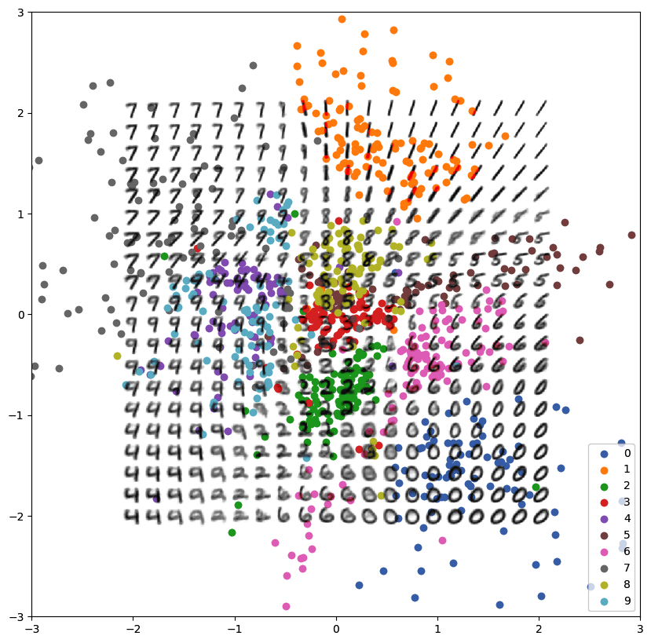
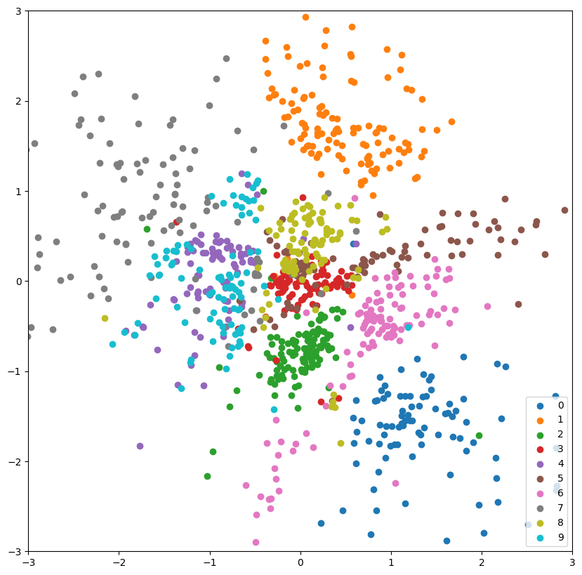
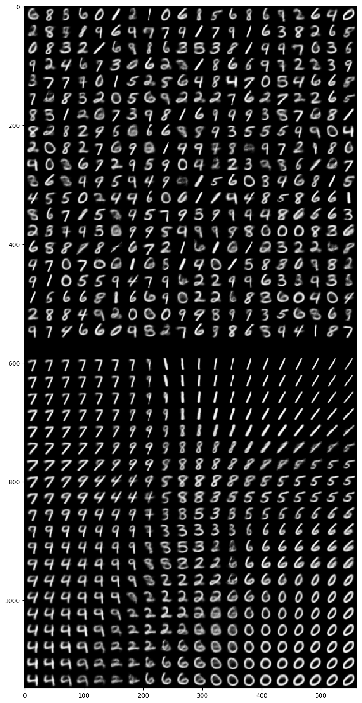

# Variational autoencoder on MNIST

Packages used, different may work as well:

```
pip3 install tensorflow==2.8.0
pip3 install tensorflow_probability==0.16.0
pip3 install tensorflow_datasets==4.5.2
```

Run using:

```
python3 main.py

    --epochs 10             Number of epochs
    --batch_size 128        Batch size
    --scatter_count 1024    Number of validation set datapoints to scatter
```

Produces the following manifold:






